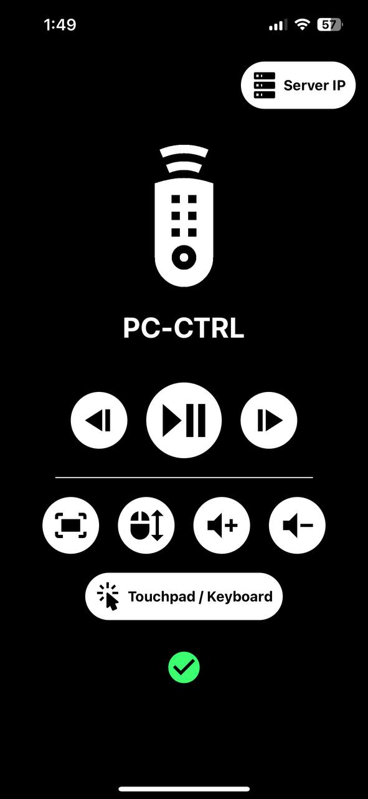
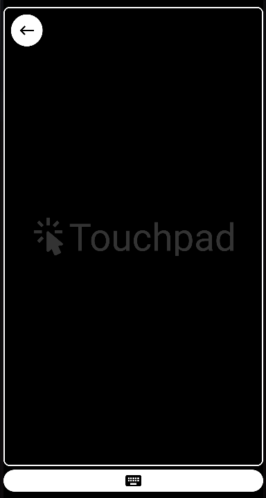

# PC-CTRL

An application which allows you to have some control on your PC through your phone such as pausing a video, open video fullscreen, shakes the cursor to see the duration of the video and most importantly a **touchpad (with a keyboard)**.

# How To Run

- Go to the server directory and run the server using this command below:

      go run .

- Then go to the client directory and run the mobile app using the command below:

      expo start

  > Please see [Expo's documentation](https://docs.expo.dev/) for more details on how to run the app

- In the app click on the top right button (Server IP):  
  
- Type the local IP of the PC that's running the server and click done.
- Wait for the app to ping the server to make sure the server is reachable.
- The icon at the bottom will show if the server is reachable or not.

# Media Controls

- Play/Pause
- Go backward or forward (Button can be held down)
- Enter/Exit Full Screen
- Shake cursor to see the duration of the video
- Volume up/down (Button can be held down)

# Touchpad

## Operations

- Left Click
- Right Click
- Drag and drop
- Scroll
- Keyboard
