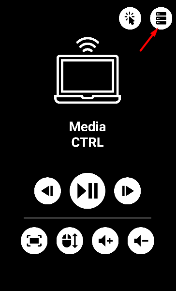

# media-ctrl
An application which allows you to have some control on your PC through your phone such as pausing a video, open video fullscreen, shakes the cursor to see the duration of the video and most importantly a **touch pad**

# How to run the Application
*   Go to the server directory and run the server using this command below:

        go run .

*   Then go to the client directory and run the mobile app using the command below:

        expo start
    >Please see [Expo's documentation](https://docs.expo.dev/) for more details on how to run the app.

* On the app click on the top right server icon:   

* Type the local IP of the PC that's running the server and click done.

# Touch pad
* To use the touch pad, click on the cursor icon at the top right.
* The touch pad behaves like a normal laptop touch pad.
## Operations
* Left Click
* Right Click
* Drag and drop
* Scroll